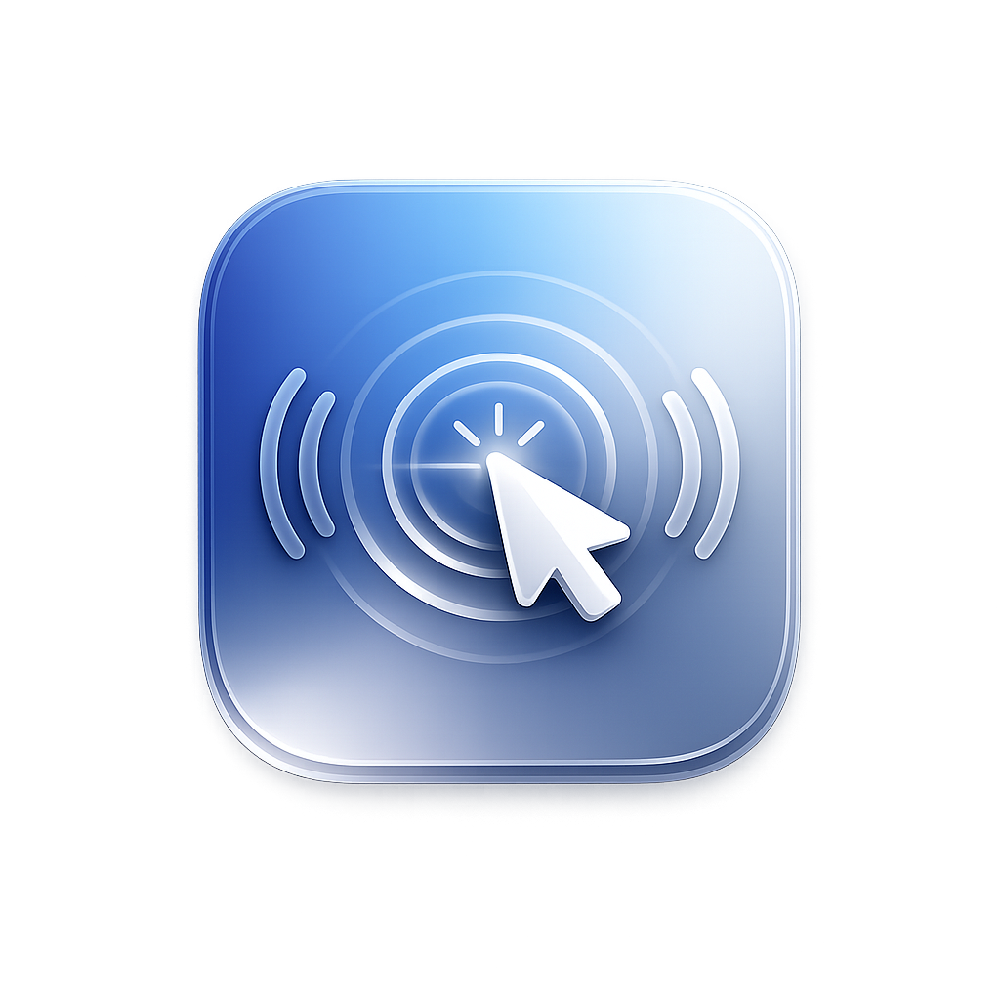

# Cliq

A menu bar app for macOS that plays a click sound whenever you click your mouse or trackpad, anywhere on the system. Press and release each have their own sound, like a mechanical switch.

## Install

Download the latest `.dmg` from the [Releases](https://github.com/eoksumm/cliq/releases) page, open it, and drag Cliq into Applications.

Cliq isn't signed with a paid Apple Developer certificate, so macOS will block it the first time you open it with a message like "Apple could not verify Cliq is free of malware." This is normal for free/open-source apps distributed outside the App Store, not a sign anything's wrong. To allow it:

1. Try to open Cliq, it'll get blocked.
2. Go to System Settings > Privacy & Security, scroll down, and click "Open Anyway" next to the Cliq message.
3. Confirm "Open" in the dialog that appears.

If you'd rather use the Terminal, this removes the quarantine flag and skips the dialogs entirely:

```
xattr -dr com.apple.quarantine /Applications/Cliq.app
```

Cliq runs from the menu bar only, there's no dock icon or window.

## Usage

Click the Cliq icon in the menu bar to open the menu:

- **Enabled** - turn click sounds on/off without quitting
- **Volume** - slider to adjust loudness
- **Click Sound** - pick between three sound packs
- **Start at Login** - launch Cliq automatically when you log in
- **Quit**

## Build from source

Requires Xcode command line tools (macOS 13+).

```
git clone https://github.com/eoksumm/cliq.git
cd cliq
./build.sh
./install.sh
```

`build.sh` compiles the app and produces `Cliq.app`. `install.sh` copies it to `/Applications` and launches it.

## Requirements

macOS 13 (Ventura) or later.
